# TRABALHO 01:  QR-Bus
Trabalho desenvolvido durante a disciplina de BD1

# Sumário

### 1. COMPONENTES 
Integrantes do grupo:  
Ewerson Vieira Nascimento: ewersonv@gmail.com 
Giuliano de Paulo Demoner: giuliano.demoner@gmail.com 
Lorran Gabriel Araújo: lorrangabriel20@gmail.com 
Marcos Antônio Carneiro de Paula: cardepaula@gmail.com 

### 2.INTRODUÇÃO E MOTIVAÇAO 
A bilhetagem eletrônica já é uma realidade nos transportes públicos do nosso estado a algum tempo, diversas pessoas fazem uso do seu cartão para se movimentar durante o dia-a-dia, seja de uso particular ou vinculado ao trabalho. Podemos dizer que a solução existente dá conta do recado e atende bem ao seu propósito, mas somente isso. Ainda temos que enfrentar diversos problemas com o uso do cartão como meio de pagamento, como a recarga em que temos que enfrentar uma fila enorme, taxas por perda ou quebra do cartão, complicado monitoramento de saldo e falta de segurança devido as fraudes. 

A partir dessa visão começamos a buscar por alternativas que poderiam atuar como meio de pagamento das passagens, sendo acessível, seguro e fácil de utilizar. A resposta estava bem na nossa frente, nossos smartphones. 

Através de tecnologias presentes nesses dispositivos seria possível efetuar o pagamento da mesma forma que já conhecemos, apenas o aproximando do leitor, ou até mesmo com um qrcode gerado e lido por câmeras já presentes nos coletivos, mas que tem como finalidade a identificação de fraudes por comparação facial. Além das funções de pagamento de um cartão comum, esse novo método traria os benefícios da internet, facilitando a recarga de nossas passagens através de cartões de credito ou boletos bancários. Como essas funções teriam que ser controlados por meio de um software, ainda poderíamos ter um controle de nossos gastos, com históricos de transações, linhas utilizadas e muito mais. 
 

### 3.MINI-MUNDO 

O sistema proposto conterá as informacões aqui detalhadas. Dos usuários serão armazenados o nome completo, data de nascimento, cpf, endereço, e-mail e senha, sendo esse dois ultimos para efetuar login no sistema. O saldo será informado de acordo com o valor referente ao saldo do usuário no próprio sistema da GVBus, sendo atualizado em tempo real a cada nova operação de recarga ou pagamento realizada. Só poderá existir um único cadastro para cada CPF. Dos meios de pagamento, serão armazenados dados de cartões de credito salvos, contendo o número do cartão, nome do titular e data de validade. Os dados armazenados pertinentes ao cartão de credito deverão seguir as regras do PCI Security Standards Council visando a confiabilidade do sistema. Um usuário pode ter mais de um cartão de crédito. O histórico de uso do aplicativo também deve ter seus dados armazenados, que são as linhas usadas, junto com a data, horário e valor debitado da conta. Os dados dos horários de onibus serão obitidos por API, que devem possuir número da linha, descrição e os horários semanais e diários de origem e destino. O itinerário também será obtido por API, com linha, sentido da linha, ponto de origem, pontos de passagem e ponto de destino da linha. O saldo do usuário deve ser sincronizado com a empresa responsável pelo seu uso (companhia de transporte). 

### 4.RASCUNHOS BÁSICOS DA INTERFACE (MOCKUPS) 
[Mockup feito com Balsamiq](/arquivos/Mockup.pdf)
#### 4.1 QUAIS PERGUNTAS PODEM SER RESPONDIDAS COM O SISTEMA PROPOSTO?
   <b>A Empresa QR-Bus precisa inicialmente dos seguintes relatórios:</b>
* Relatório que informe ao usuário seu histórico de viagens, com dias e horários em que usou o sistema, assim como as linhas utilizadas.
* Relatório que informe as linhas mais utilizadas e as menos utilizadas (por todos os usuários) dependendo do horário.
* Lista direcionada ao usuário informando as melhores opções de linhas para sair de sua origem à seu destino.
* Relatório que informe à gerência bairros ou pontos de ônibus onde há maior concentração de passageiros que efetuam o embarque e o desembarque dos coletivos.
* Relatório de tempo médio de viagem de cada linha do ponto de partida ao ponto de chegada (definidos pelo usuário).
* Relatório direcionado ao usuário para controle de seu saldo, com quantidade de viagens feitas por dia/semana/mês, valor de cada viagem e gasto total no período definido.
 
#### 4.2 TABELA DE DADOS DO SISTEMA:
[Tabela de dados QR-Bus](https://github.com/qr-bus/trab01/tree/master/arquivos/Tabelao_qr-bus.xlsx?raw=true "Tabela - Empresa QR-Bus")
    
>## Marco de Entrega 01 em: (06/09/2018) 

### 5.MODELO CONCEITUAL 
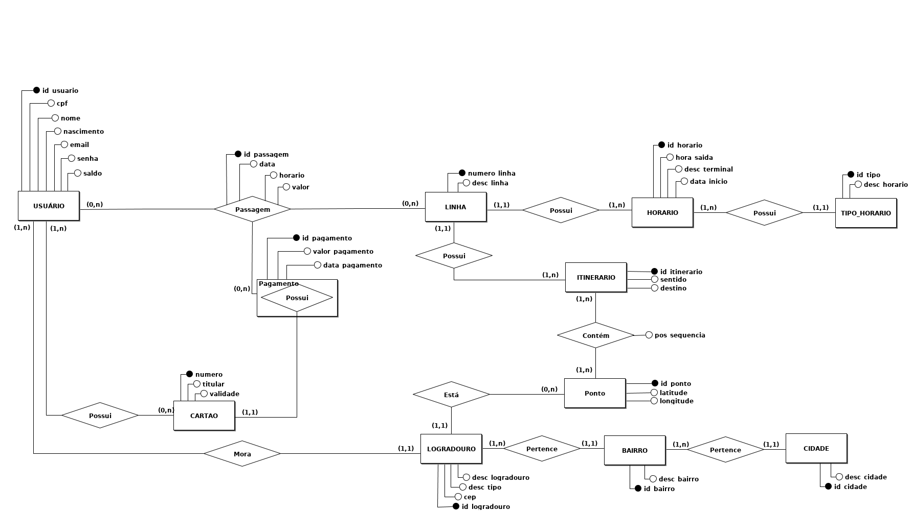 

     
        
    
#### 5.1 Validação do Modelo Conceitual
   <b>[Grupo01]:</b> Psicultura Inteligente (André Altivo, Gabriela Piffer, Lucca Machado e Marcelo Mendes)
    <b>[Grupo02]:</b> Carga Pesada (Leonardo Sena, Matheus Aguiar, Wallace de Paula e Willian Vaneli)

#### 5.2 DECISÕES DE PROJETO
   <b>Tipo_Horario:</b> Essa tabela foi criada com o intuito de identificar qual o tipo de horario será seguido por aquela linha, dias úteis, feriados, atípicos entre feriados ou fins de semana. 
   
   <b>Cartão:</b> A tabela cartão possui relação (0,n) com usuário, pois decidimos que o usuário pode ou não ter um cartão de crédito para usar o app. 
   
>## Marco de Entrega 02 em: (17/09/2018) 
#### 5.3 DESCRIÇÃO DOS DADOS 
   <b>USUARIO:</b> Tabela que armazena informações relacionadas ao usuário do sistema. 
   		id_usuario: id do usuário, gerado automaticamente. 
		cpf: cpf do usuário. 
		nome: nome completo do usuário. 
		nascimento: data de nascimento do usuário. 
		email: email do usuário. 
		senha: senha do usuário. 
		saldo: saldo do usuário para pagamento de passagens. 
   <b>CARTAO:</b> Tabela que contém dados do cartão de passagem do usuário. 
   		numero: número do cartão do usuário. 
		titular: nome do titular do cartão. 
		validade: data de validade presente no cartão. 
   <b>PASSAGEM:</b> Tabela que armazena os pagamentos de passagens em datas e horarios específicos. 
   		id_passagem: id da passagem, gerado automaticamente. 
		numero_linha: linha utilizada pelo usuário. 
		data: data em que o usuário pagou a passagem. 
		horario: horário em que a passagem foi paga. 
		valor: valor da passagem paga. 
   <b>LINHA:</b> Contém informações sobre a linha do ônibus. 
   		numero_linha: número da linha. 
		desc_linha: descrição (nome) da linha. 
		sentido: informa o sentido que a linha percorrerá (ida ou volta). 
   <b>HORÁRIO:</b> Contém dados sobre horarios das linhas. 
   		id_horario: id da linha, gerado automaticamente. 
		hora_saida: horário em que o ônibus sai do terminal. 
		desc_terminal: nome do terminal que o ônibus sairá. 
		data_inicio: data em que este horário começou a ser utilizado. 
   <b>TIPO_HORARIO:</b> Tabela que armazena os tipos de horário. 
   		id_tipo: id do tipo de horário, gerado automaticamente. 
		desc_horario: descrição do tipo (dias úteis, feriados, atípicos entre feriados ou fins de semana). 
   <b>ITINERARIO:</b> Armazena informações sobre o sentido da linha (ida ou volta) e a sequência de pontos que ela percorrerá. 
   		id_itinerario: id do itinerário atrelado a cada rua que a linha percorrerá, gerado automaticamente. 
		sequencia: cada rua pela qual o ônibus passará. 
   <b>PONTO:</b> Armazena as coordenas do ponto. 
   		id_ponto: id do ponto, gerado automaticamente. 
		latitude: latitude para posição geográfica do ponto. 
		longitude: longitude para posição geográfica do ponto. 
   <b>LOGRADOURO:</b> Armazena informações sobre o logradouro (CEP, tipo e nome). 
   		id_logradouro: id do logradouro, gerado automaticamente. 
		cep:  
		desc_tipo: descrição do tipo de logradouro (rua, avenida, travessa...). 
		desc_logradouro: nome do logradouro. 
   <b>BAIRRO:</b> Armazena informações sobre o bairro (nome e ID). 
   		id_bairro: id do bairro, gerado automaticamente. 
		desc_bairro: nome do bairro. 
   <b>CIDADE:</b> Armazena informações sobre a cidade (nome e ID). 
   		id_cidade: id da cidade, gerado automaticamente. 
		desc_cidade: nome da cidade. 

### 6	MODELO LÓGICO 
   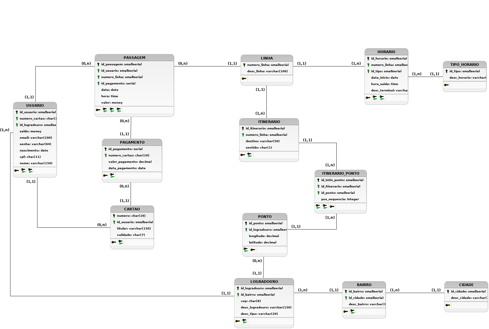 

### 7	MODELO FÍSICO 
   [Modelo Fisico](arquivos/QR-Bus_-_modelo_fisico.sql)         
        
### 8	INSERT APLICADO NAS TABELAS DO BANCO DE DADOS 
#### 8.1 DETALHAMENTO DAS INFORMAÇÕES 
   [Inserção dos dados](sql/insert.sql)

#### 8.2 INCLUSÃO DO SCRIPT PARA CRIAÇÃO DE TABELAS E INSERÇÃO DOS DADOS
   [Create + Inserts](sql/create_e_insert.sql)
   
#### 8.3 INCLUSÃO DO SCRIPT PARA EXCLUSÃO DE TABELAS EXISTENTES, CRIAÇÃO DE TABELA NOVAS E INSERÇÃO DOS DADOS
   [Drop + Create + Inserts](sql/drop_create_insert.sql)
>## Marco de Entrega 03 em: (27/09/18)  

### 9	TABELAS E PRINCIPAIS CONSULTAS 
    OBS: Incluir para cada tópico as instruções SQL + imagens (print da tela) mostrando os resultados. 
#### 9.1	CONSULTAS DAS TABELAS COM TODOS OS DADOS INSERIDOS (Todas)  

<b>SELECT * FROM cidade;

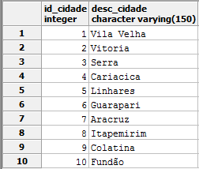

<b>SELECT * FROM bairro;

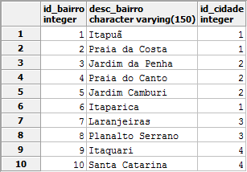

<b>SELECT * FROM logradouro;

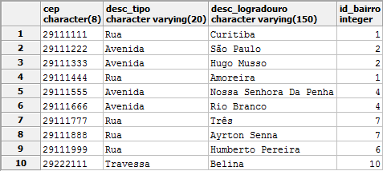

<b>SELECT * FROM tipo_horario;

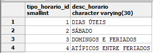

#### 9.2	CONSULTAS DAS TABELAS COM FILTROS WHERE (Mínimo 4) 

<b>SELECT * FROM logradouro WHERE desc_tipo = 'Avenida';</b>

#### 9.3	CONSULTAS QUE USAM OPERADORES LÓGICOS, ARITMÉTICOS E TABELAS OU CAMPOS RENOMEADOS (Mínimo 11)
    a) Criar 5 consultas que envolvam os operadores lógicos AND, OR e Not
    
   <b>SELECT * FROM logradouro WHERE desc_logradouro = 'Rio Branco' OR id_bairro = '2';</b>
   
   
   
   <b>SELECT hora_saida, numero_linha FROM horario WHERE (hora_saida > '09:09:00' AND numero_linha = 507);</b>
   
   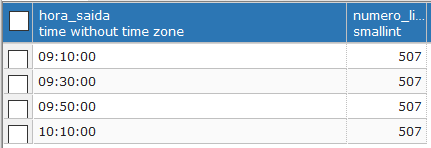
   
   <b>SELECT hora_saida, numero_linha FROM horario WHERE ((hora_saida > '09:09:00') AND (numero_linha = 507 OR  numero_linha = 516));</b>
   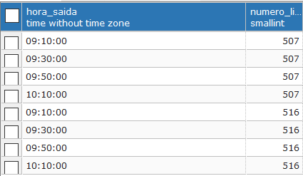
   
   <b>SELECT (desc_tipo|| '. '||desc_logradouro) FROM logradouro WHERE ((id_bairro = 4) OR (id_bairro = 7));</b>
   
   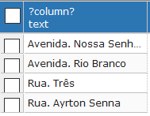
   
   <b>SELECT hora_saida, numero_linha FROM horario WHERE ((hora_saida > '09:09:00') AND (NOT numero_linha = 815));</b>
   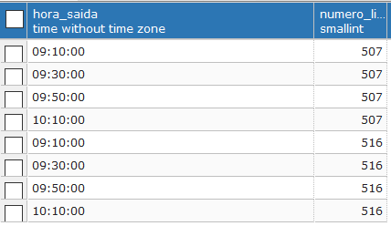
   
   
   
    b) Criar no mínimo 3 consultas com operadores aritméticos 
    c) Criar no mínimo 3 consultas com operação de renomear nomes de campos ou tabelas
    
#### 9.4	CONSULTAS QUE USAM OPERADORES LIKE E DATAS (Mínimo 12)  
    a) Criar outras 5 consultas que envolvam like ou ilike
    b) Criar uma consulta para cada tipo de função data apresentada.

#### 9.5	ATUALIZAÇÃO E EXCLUSÃO DE DADOS (Mínimo 6) 

>## Marco de Entrega 04 em: (18/10/2017) 

#### 9.6	CONSULTAS COM JUNÇÃO E ORDENAÇÃO (Mínimo 6) 
        a) Uma junção que envolva todas as tabelas possuindo no mínimo 3 registros no resultado
        b) Outras junções que o grupo considere como sendo as de principal importância para o trabalho
#### 9.7	CONSULTAS COM GROUP BY E FUNÇÕES DE AGRUPAMENTO (Mínimo 6) 
   
   <b>SELECT COUNT(cep), desc_tipo FROM logradouro GROUP BY desc_tipo;</b>
   
   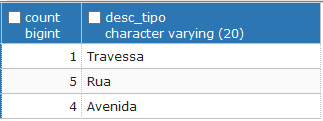
   
#### 9.8	CONSULTAS COM LEFT E RIGHT JOIN (Mínimo 4) 
   <b>SELECT COUNT(bairro.id_bairro), cidade.desc_cidade, cidade.id_cidade
   FROM bairro
   LEFT JOIN cidade
   ON bairro.id_cidade = cidade.id_cidade
   GROUP BY cidade.id_cidade
   ORDER BY cidade.id_cidade;</b>
   
   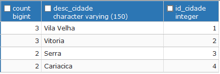
   
   <b>SELECT COUNT(logradouro.cep), bairro.desc_bairro
   FROM logradouro
   LEFT JOIN bairro
   ON logradouro.id_bairro = bairro.id_bairro
   GROUP BY bairro.desc_bairro
   ORDER BY bairro.desc_bairro;</b>
   
   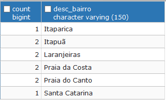
   
#### 9.9	CONSULTAS COM SELF JOIN E VIEW (Mínimo 6) 
        a) Uma junção que envolva Self Join
        b) Outras junções com views que o grupo considere como sendo de relevante importância para o trabalho
#### 9.10	SUBCONSULTAS (Mínimo 3) 
### 10	ATUALIZAÇÃO DA DOCUMENTAÇÃO DOS SLIDES PARA APRESENTAÇAO FINAL (Mínimo 6 e Máximo 10) 

### 11 Backup completo do banco de dados postgres 
    a) deve ser realizado no formato "backup" 
        (Em Dump Options #1 Habilitar opções Don't Save Owner e Privilege)
    b) antes de postar o arquivo no git o mesmo deve ser testado/restaurado por outro grupo de alunos/dupla
    c) informar aqui o grupo de alunos/dupla que realizou o teste.

### 12	TUTORIAL COMPLETO DE PASSOS PARA RESTAURACAO DO BANCO E EXECUCAO DE PROCEDIMENTOS ENVOLVIDOS NO TRABALHO PARA OBTENÇÃO DOS RESULTADOS 
        a) Outros grupos deverão ser capazes de restaurar o banco 
        b) executar todas as consultas presentes no trabalho
        c) executar códigos que tenham sido construídos para o trabalho 
        d) realizar qualquer procedimento executado pelo grupo que desenvolveu o trabalho
        
### 13   DIFICULDADES ENCONTRADAS PELO GRUPO 
>## Marco de Entrega Final em: (08/11/2018) 
        
### 14  FORMATACAO NO GIT: https://help.github.com/articles/basic-writing-and-formatting-syntax/
<comentario no git>
    
##### About Formatting
    https://help.github.com/articles/about-writing-and-formatting-on-github/
    
##### Basic Formatting in Git
    
    https://help.github.com/articles/basic-writing-and-formatting-syntax/#referencing-issues-and-pull-requests
    
    
##### Working with advanced formatting
    https://help.github.com/articles/working-with-advanced-formatting/
#### Mastering Markdown
    https://guides.github.com/features/mastering-markdown/

    

    
### OBSERVAÇÕES IMPORTANTES

#### Todos os arquivos que fazem parte do projeto (Imagens, pdfs, arquivos fonte, etc..), devem estar presentes no GIT. Os arquivos do projeto vigente não devem ser armazenados em quaisquer outras plataformas.
1. Caso existam arquivos com conteúdos sigilosos, comunicar o professor que definirá em conjunto com o grupo a melhor forma de armazenamento do arquivo.

#### Todos os grupos deverão fazer Fork deste repositório e dar permissões administrativas ao usuário do git "profmoisesomena", para acompanhamento do trabalho.

#### Os usuários criados no GIT devem possuir o nome de identificação do aluno (não serão aceitos nomes como Eu123, meuprojeto, pro456, etc). Em caso de dúvida comunicar o professor.

Link para BrModelo: 
http://www.sis4.com/brModelo/download.html
 

Link para curso de GIT 

